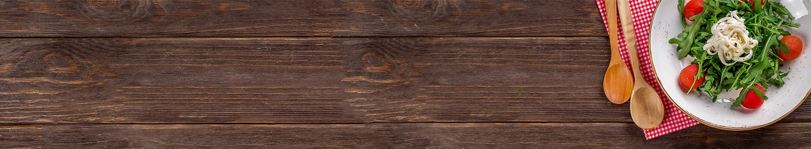

## Code Institute Data Centric Development Milestone Project
# High Cuisine
High Cuisine is an cookbook where users can search for recipes, registered users can submit, edit and delete recipes they have posted. However, the focus is on cannabis-based recipes.

[Visit deployed site](https://high-cuisine-app.herokuapp.com/)

## Table of Contents

## UI/UX
### Project goals
High Cuisine is the 3rd milestone project for Code Institute Data Centric Development module. The goal of this project is to create, store, edit and delete recipes (CRUD). The target group of this project consists of people who like to cook with cannabis.
The focus is on people with chronic diseases. My personal goal was to create a very simple recipe site on which the user can upload recipes quickly and easily and does not receive too much other distracting information.
A secondary goal is to sell a print version of a fictitious cookbook and the Levo Infuser.

### User Stories

As a User I would like to:
- [x] Access the site from different devices like phone, tablet or Desktop PC
- [x] Be able to register to have my own profile.
- [x] Be able to browse and navigate information easily.
- [x] Be able to search recipes by ingredients or name etc.
- [x] Submit my own recipes
- [x] Sign up or Sign in with user friendly form
- [x] Edit and delete my own recipes, without others tampering with my submitted recipes.
- [x] Get feedback for submitting/editing/logging in/logging out
- [x] Access a list of all recipes
- [x] Get error messages in case user has done something wrong or there is an issue with database.
- [ ] Browse recipes by category

As an admin I would like to do all of the above plus:
- [x] Be able to access, edit and delete ALL recipes from admin profile

### Design
Main inspiration for the main page comes from Meatblog site. After talking to a chronically ill friend, I decided on a cannabis-based recipe website.

Since the color green is associated with cannabis, it was easy to decide on a color scheme. All elements except the delete buttons are displayed in a uniform green. The logo and favicon were designed with Adobe Illustrator. It includes a cannabis leaf and a chef's hat. I kept the default font-style of Materialize because it provides a good readability and looks modern.

#### Research
There are tons of recipe websites out there. However, most of them are packed with too much information. Most cannabis recipe sites didn't specialize in this. They only contained links to individual recipes with cannabis.

#### Wireframes
Using the user stories above, I put together the wireframes using Balsamiq. The wireframes covered desktop, tablet and mobile formats. Due to the navigation items changing depending on whether a user is signed in or not, a number of additional wireframes were needed to be created to show the difference. For example, when a user is not signed in to the site, they cannot view the ‘Add Recipe’ page and can see buttons in the main navigation for Register and Sign In. When a user has registered/signed into the site, these buttons are hidden and ‘Sign Out’ becomes visible, as does ‘Add a Recipe'.

[You can view all of the wireframes here][all_wireframes.pdf](https://github.com/lemon-squeezy/high-cuisine/files/5791535/all_wireframes.pdf)