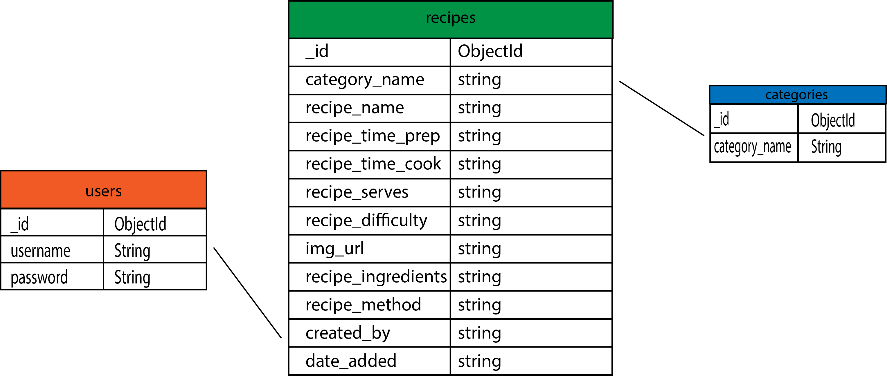

## Code Institute Data Centric Development Milestone Project
# High Cuisine
High Cuisine is an cookbook where users can search for recipes, registered users can submit, edit and delete recipes they have posted. However, the focus is on cannabis-based recipes.

[Visit deployed site](https://high-cuisine-app.herokuapp.com/)

## Table of Contents

## UI/UX
### Project goals
High Cuisine is the 3rd milestone project for Code Institute Data Centric Development module. The goal of this project is to create, store, edit and delete recipes (CRUD). The target group of this project consists of people who like to cook with cannabis.
The focus is on people with chronic diseases. My personal goal was to create a very simple recipe site on which the user can upload recipes quickly and easily and does not receive too much other distracting information.
A secondary goal is to sell a print version of a fictitious cookbook and the Levo Infuser.

### User Stories

As a User I would like to:
- [x] Access the site from different devices like phone, tablet or Desktop PC
- [x] Be able to register to have my own profile.
- [x] Be able to browse and navigate information easily.
- [x] Be able to search recipes by ingredients or name etc.
- [x] Submit my own recipes
- [x] Sign up or Sign in with user friendly form
- [x] Edit and delete my own recipes, without others tampering with my submitted recipes.
- [x] Get feedback for submitting/editing/logging in/logging out
- [x] Access a list of all recipes
- [x] Get error messages in case user has done something wrong or there is an issue with database.
- [ ] Browse recipes by category

As an admin I would like to do all of the above plus:
- [x] Be able to access, edit and delete ALL recipes from admin profile

### Design
Main inspiration for the home page comes from Meatblog site. After talking to a chronically ill friend, I decided on a cannabis-based recipe website.

Since the color green is associated with cannabis, it was easy to decide on a color scheme. All elements except the delete buttons are displayed in a uniform green. The logo and favicon were designed with Adobe Illustrator. It includes a cannabis leaf and a chef's hat. I kept the default font-style of Materialize because it provides a good readability and looks modern.

#### Research
There are tons of recipe websites out there. However, most of them are packed with too much information. Most cannabis recipe sites didn't specialize in this. They only contained links to individual recipes with cannabis.

#### Wireframes
Using the user stories above, I put together the wireframes using Balsamiq. The wireframes covered desktop, tablet and mobile formats. Due to the navigation items changing depending on whether a user is signed in or not, a number of additional wireframes were needed to be created to show the difference. For example, when a user is not signed in to the site, they cannot view the ‘Add Recipe’ page and can see buttons in the main navigation for Register and Sign In. When a user has registered/signed into the site, these buttons are hidden and ‘Sign Out’ becomes visible, as does ‘Add a Recipe'.

##### Wireframes for desktop
[View all wireframes here](static/readme_docs/desktop_wireframes.pdf)

##### Wireframes for desktop
##### Wireframes for desktop

#### Color Palette

I kept the color pallette very simple and clean because the content of the uploaded recipes is very colorful.
The main color is Spanish Green #2B934D and simple white #FFF. It"s used for the logo, buttons, headings and some text.
Orange Soda #F74B2C is used for buttons like: Delete, Edit ...

### Defensive design

* User is not able to break the site by clicking buttons out of the expected order.
* All forms handle empty input fields by warning the user and not permitting recipe submission.
* Navigating between pages via the back/forward buttons does not break the site. 
* User errors do not cause database errors
* User is given feedback for actions/errors

## Features
### Existing features

- [x] Search: users are able to search for recipes by username, title or any other text. If no results are found message "No results found".
- [x] Access Shop page via in Navbar
- [x] Signup
- [x] Login
- [x] Access to user profile with all users recipes
- [x] If user has not posted anything yet, the page title reads "Nothing here yet" and has "SUMBIT RECIPE" button. 
- [x] When user loggs out user receives "You have been logged out" flashed message.
- [x] Profile page displays "Hello username"
- [x] Only registered and logged in users allowed to sumbit/edit and delete recipes.
- [x] Only user that posted the recipe can delete and/or edit it.
- [x] Social icons with links in the page footer
- [x] Recipes displayed in list have title, user information, date_added
- [x] Single recipe page have full recipe information, the date it was first created, image and list.
- [x] Submit recipe and edit recipe forms have clear instructions and character limits for certain fields. 
- [x] If password is too short or email is invalid etc tooltip appears
- [x] Favicon

### Future features
- [ ] Sorting by category by clicking navigation links.
- [ ] Pagination
- [ ] Save favourite recipes by clicking a like button
- [ ] Google login 
- [ ] Prevent duplicate subscribers
- [ ] "Remember me" signup checkbox
- [ ] Edit user profiles
- [ ] User profiles with description, avatar, post list
- [ ] Ability to click on other user profiles and see recipes they posted
- [ ] Page loading animation
- [ ] Third party search engine
- [ ] Subscription letters
- [ ] Filter emails so that there are no duplicates for subscription letters
- [ ] Admin console
- [ ] Contact form and admin to be able to see all recieved messages directly in the admin console
- [ ] Recipe image url validation
- [ ] Admin recipe review to either accept or reject recipe for it to be public.
- [ ] More categories
- [ ] Admin able to add/edit/delete categories
- [ ] Sort recipes by tag, cousine, cook or prep time, even more specific dietary needs
- [ ] SSL certificate
- [ ] Recipe Comments

### Information Architecture
MongoDB Atlas is used for storing data for this web site.

#### Current schema: 

## Technologies Used
I used a number of languages, frameworks and tools to construct my website. These include;

* [HTML](https://html.com/)
* [CSS](https://www.w3.org/Style/CSS/Overview.en.html) 
* [JavaScript](https://www.javascript.com/) 
* [jQuery](https://jquery.com/)
* [Python](https://www.python.org/)
    * [Flask](https://flask.palletsprojects.com/en/1.1.x/)
    * [Jinja](https://jinja.palletsprojects.com/en/2.11.x/) 
    * [Werkzeug security](https://werkzeug.palletsprojects.com/en/1.0.x/)
* [Materialize](https://materializecss.com/)
* [Google Chrome Developer tools](https://developers.google.com/web/tools/chrome-devtools)
* [GitHub](https://github.com/)
* [GitPod](https://www.gitpod.io/)
* [MongoDB](https://www.mongodb.com/)
* [Heroku](https://www.heroku.com/)
* [ShareThis](https://sharethis.com/)
* [Font Awesome](https://fontawesome.com/)

## Tools Used
* [Balsamiq](https://balsamiq.com/) - Used to create my wireframes, showing the positioning of elements on varying screen sizes.
* [Adobe Photoshop](https://www.adobe.com/uk/products/photoshop.html) - Photoshop was used to create the banner and favicon.
* [Adobe Illustrator](https://www.adobe.com/uk/products/photoshop.html) - illustrator was used o create the logo.
* [W3C HTML Validator](https://validator.w3.org/) - I used this tool to check the validity of my HTML code.
* [W3C CSS Validator](https://jigsaw.w3.org/css-validator/) - I used this tool to check the validity of my CSS code.
* [Autoprefixed](https://autoprefixer.github.io/) - I used this tool to check the prefixes of my CSS code.
* [PEP8](http://pep8online.com/) - I used this tool to check that my app.py file meets the PEP8 requirements.

## Testing
Devices and platforms used for testing:

* Iphone X 
    - Safari
    - Chrome
    - Brave
* Ipad Pro
    - Safari 
    - Chrome
* Lenovo Thinkpad E590 16.5"
    - Chrome
    - Firefox
    - Brave

### Validators and linters

* [W3C HTML Validator](https://validator.w3.org/#validate_by_input) Passed tests without issues
* [W3C CSS Validator](https://jigsaw.w3.org/css-validator/#validate_by_input) Passed tests without issues
* [JSHint](https://jshint.com) Passed tests without issues
* JSHint VSCode extension
* [PEP8](http://pep8online.com). Online PEP8 warns about lines being too long or closing bracket does not match visual indentation, otherwise no issues. I tried to use a Python formatter but the issues are still there.

**PEP8 Compliance:**
I used the website [PEP8](http://pep8online.com/) to check my app.py files complied with the PEP8 requirements. 

### Manual testing

1. Visiting page
    * Test if navigation works correctly on  all devices  like phone, tablet or desktop PC
    * Test if page is responsive at all sizes
    * Test footer social icon links (links open homepages in a new window)
    * Attempt accessing non-existant endpoints: Correctly returns 404.html with access to go back to homepage
    * Verify that shop page looks as it should.
    * Try submitting empty form or invalid email (shows tooltip "Enter an email adress")
2. Register
    * Try registering with empty form/inputs (shows tooltip "Fill out this field")
    * Try to register with invalid email ("Enter an email adress")
    * Attempt to use username/password that is too long ("Match the requested format!")
3. Login 
    * Try using empty form (shows tooltip "Fill out this field")
    * Try to use not existing or wrong credentials ("Incorrect Username and/or Password!")
4. Add recipe
    * Go to the "Add Recipe" page
    * Try to submit empty form and verify that no recipe has been added to any category page.
    * Try to submit filled out form and verify that fields appear correctly, there is no missing information
    * Try to submit recipe with empty fields
5. Edit recipe
    * Try to submit recipe with empty fields
    * Test edit button, submit edit button
    * Check if changes have been made and displayed correctly
6. Delete recipe
    * Visit recently posted recipe and try the Delete button
    * Delete button opens a modal.
    * Test cancel button 
    * Test delete button 
    * Verify that recipe has been deleted
7. Logout
    * Log out
    * Test accessing pages available only for logged in users e.g. profile page or thank you page (Wraps redirects to Login page)
8. Search
    * Search a recipe by ingredient or title 
    * If no recipes are found, user is notified "No results found."

    Note: search does not return results for words like "and", "if", "other", "after"

### Errors

**Current Issues:**
* I used a quick share option for users via sharethis.com It works fine for chrome and brave but not for Firefox. 
This is related to browser add-ons such as ghostery.

**Warnings:**
The type attribute is unnecessary for JavaScript resources. From line 16, column 9; to line 16, column 173 (fixed)

**Lighthouse:**
Since I link to external websites in my footer, Lighthosue made me aware of a lack of security precautions. I added: rel="noopener"
